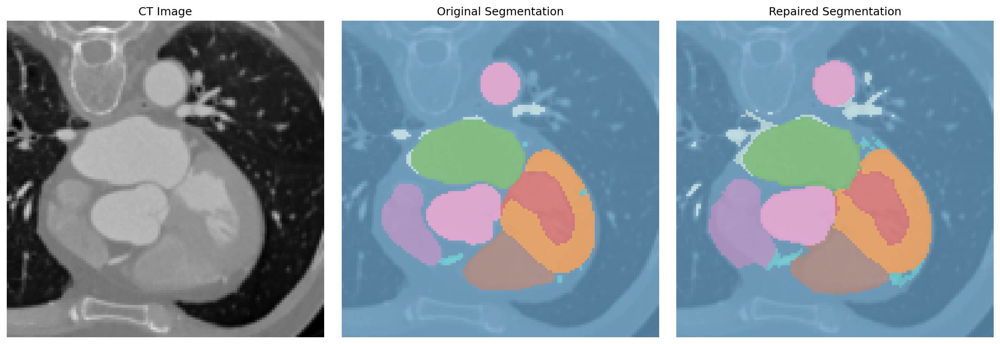

# MultiNeAR: Multi-Class Neural Annotation Refinement for Cardiac CT

Connectivity-aware implicit neural representation for refining cardiac CT segmentation annotations.

## Overview

NeAR learns sample-specific latent representations to refine noisy segmentation labels by modeling anatomical structures as continuous implicit functions. This implementation extends the original NeAR approach with:

- **Connectivity constraints** to reduce fragmentation
- **11-class cardiac structures** (myocardium, chambers, vessels)
- **Multi-resolution training** (96³ training and inference)
- **Appearance integration** using CT intensity information

## Quick Start

### Installation

```bash
# Clone repository
git clone https://github.com/Junjiecheng2024/MultiNeAR
cd MultiNeAR

# Create environment
conda create -n near python=3.9
conda activate near

# Install dependencies
conda install pytorch torchvision pytorch-cuda=11.8 -c pytorch -c nvidia
pip install nibabel numpy pandas tqdm matplotlib scikit-image scipy
```

### Data Format

Prepare data in this structure:
```
data_root/
├── appearance/          # CT volumes (.npy, 96³, float32)
├── shape/               # Labels (.npy, 96³, int 0-10)
└── info.csv            # Sample IDs
```

**11 Classes**: Background(0), Myocardium(1), LA(2), LV(3), RA(4), RV(5), Aorta(6), PA(7), LAA(8), Coronary(9), PV(10)

### Training

```bash
cd near_repairing
python near_repair.py
```

Monitor training:
```bash
nohup python near_repair.py > train.log 2>&1 &
tail -f train.log
```

### Inference

```bash
python inference.py \
    --model_path runs/cardiac_near_*/best.pth \
    --output_dir results \
    --save_visualization
```

Outputs:
- `repaired_segmentations/*.nii.gz` - Refined labels
- `evaluation_results.csv` - Dice scores per sample
- `visualizations/*.png` - CT + Original + Refined comparison

## Key Configuration

Edit `near_repairing/config_cardiac.py`:

```python
cfg = dict(
    data_path="/path/to/data",
    num_classes=11,
    
    # Resolution
    target_resolution=96,
    training_resolution=96,
    
    # Training
    n_epochs=800,
    batch_size=8,
    lr=3e-4,
    
    # Loss weights
    lambda_dice=1.0,        # Dice loss
    lambda_conn=1.0,        # Connectivity loss (reduce fragmentation)
    lambda_latent=1e-2,     # L2 regularization
    
    # Connectivity components
    conn_tv_weight=0.3,           # Total variation
    conn_boundary_weight=0.15,     # Boundary smoothness
    conn_compactness_weight=0.15,  # Region compactness
)
```

## Project Structure

```
MultiNeAR/
├── near/                          # Core library
│   ├── datasets/                  # Data loading
│   ├── models/                    # Model architectures and losses
│   │   └── nn3d/                 # 3D neural networks
│   └── utils/                     # Utilities
├── data_prepare/                  # Data preprocessing scripts
├── near_repairing/                # Training and inference
│   ├── near_repair.py            # Training script
│   ├── inference.py              # Inference script
│   └── config_cardiac.py         # Configuration
├── validation/                    # Evaluation tools
│   └── connected_components_analyze.py  # Topology analysis
└── assets/                        # Documentation assets
```

## Results

Our V2 model (connectivity-aware) achieves:
- **Dice Score**: 0.571 ± 0.084
- **Connected Components**: 114.33 per volume (21% reduction vs V1)
- **Best Classes**: LV (0.93), Myocardium (0.89), LA (0.88)
- **Challenging Classes**: Coronary arteries (0.13), small vessels



*Visualization: CT image (left), original segmentation (middle), refined segmentation (right)*

## Citation

Based on the original NeAR paper:

```bibtex
@inproceedings{yang2022near,
  title={Neural Annotation Refinement: Development of a New 3D Dataset for Adrenal Gland Analysis},
  author={Yang, Jiancheng and Shi, Rui and Wickramasinghe, Udaranga and Zhu, Qikui and Ni, Bingbing and Fua, Pascal},
  booktitle={MICCAI},
  pages={503--513},
  year={2022}
}
```

## References

- Original NeAR: [arXiv:2206.15328](https://arxiv.org/abs/2206.15328) | [GitHub](https://github.com/HINTLab/NeAR)
- Dataset: [Public Cardiac CT Dataset](https://github.com/Bjonze/Public-Cardiac-CT-Dataset)

## License

Apache License 2.0

